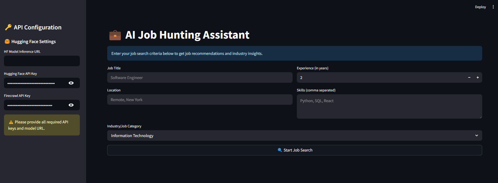

# JobSearchTool
Personalized, AI-powered career coach that finds the best job opportunities and provides strategic application advice — all powered by Hugging Face LLMs, Firecrawl web scraping, and Streamlit.

## 📸 Demo Screenshot

🚀 What it does
🔍 Smart Job Search
Just enter your role, location, experience, and skills — and the assistant will:

Search job listings across top platforms like Indeed, Naukri, and Monster

Extract structured job data using Firecrawl

Analyze roles using LLMs to recommend the best matches

📊 Industry Insights
It also:

Scrapes salary, skill, and demand trends from platforms like Payscale and Glassdoor

Uses an LLM to provide career growth advice tailored to your domain

🧠 LLM-Powered Analysis
Thanks to Hugging Face Inference API, the assistant:

Explains pros & cons of each job

Ranks top 3 best-fit jobs

Suggests personalized resume and application strategies

🎯 Tracked with Opik + Comet
All LLM calls and reasoning steps are traceable and explainable, with observability using Comet’s Opik integration.

🧰 Tech Stack
🧠 Hugging Face LLM (e.g., mistralai/Mistral-7B-Instruct)

🔍 Firecrawl for AI-based web scraping

🌐 Streamlit for the frontend

🧪 Pydantic for schema validation

🧭 Opik + Comet for LLM observability

🌱 Python 3.9+

📦 How to Run:

git clone https://github.com/Harshadeep100/JobSearchTool.git
cd ai-job-hunting-assistant [Direct to that respective folder]
pip install -r requirements.txt
streamlit run main.py

🔐 Add a .env file with the following:

FIRECRAWL_API_KEY=your_firecrawl_key
HF_API_KEY=your_huggingface_key
HF_MODEL_URL=https://api-inference.huggingface.co/models/your-model-name
COMET_API_KEY=your_comet_key

🌍 Ideal For
Job seekers looking for tailored opportunities

Data scientists, developers, and engineers

Career advisors building AI-powered tools

Anyone exploring LLMs + real-world web data

📌 Features Coming Soon
Resume score and match against job descriptions

LinkedIn job scraping

Export selected jobs to PDF

Email alerts for daily job insights

🧠 Author
Built by Harshadeep Gelli — AI Specialist passionate about making job search smarter with open-source tools.

